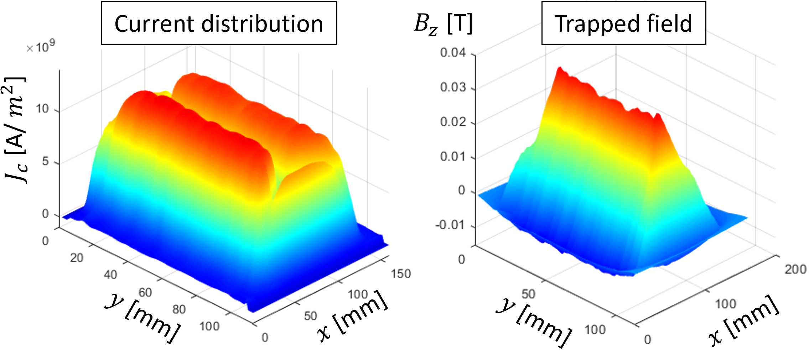
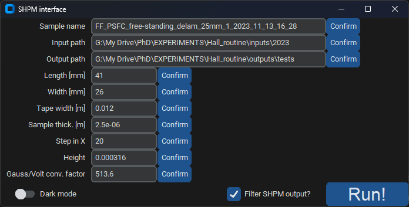

# Scanning Hall Probe Microscopy (SHPM): Data Processing Tool

This software processes data from Scanning Hall Probe Microscopy (SHPM) measurements, primarily used for characterizing superconducting coated conductors. It was developed during my PhD in Physics at the Institute of Materials Science of Barcelona (ICMAB-CSIC).

## Objectives

This software streamlines superconducting material (type-II) analysis, enabling researchers to extract meaningful insights from SHPM data quickly and accurately.

## Key Features

- ✅ Computes the **current density distribution ($J_c$)** using the **Biot-Savart law**  
- ✅ Processes SHPM data stored in **CSV format**  
- ✅ Generates high-quality plots of the **trapped field** and **current density distribution**  
- ✅ Includes a **Graphical User Interface (GUI)** for ease of use  


## Example Outputs



## Screenshot of the interface



## Installation and Setup

### 1) Prerequisites
Ensure you have the following installed:
   - **Python 3.4+** (recommended: Python 3.7+)
   - **MATLAB 2015a+** (must be compatible with Python version)
   - **MATLAB Statistics Toolbox**
   - **VSCode** (or another IDE)
   - **Git Bash** (for repository cloning)

### 2) Clone the Repository

- Open **Git Bash** terminal.
- Navigate to the desired directory for the project (e.g., `cd C:\Users\XXX\Desktop\workspace`).
- Run the following command:
  ```bash
  git clone https://github.com/lamasne/hall_routine.git
  ```
How to use:

### 3) Download all Python packages and Set Up Matlab-Python Integration

To install all required Python packages, use the following command from within a virtual environment or any terminal:
```bash
pip install -r requirements.txt
```
If you encounter dependency issues, modify the `requirements.txt` file based on the error messages you receive and re-run the installation command. 

In particular, to enable MATLAB functionality within Python, the MATLAB Engine API must be installed. If the previous step fails for `matlabengine` (in which case the line `import matlab.engine` in `model_and_view/interface.py` would typically be highlighted in yellow), you have two options:

#### Option 1: Install matlabengine via pip
Install a compatible version of the MATLAB Engine API. For instance, for `Python3.12` and `Matlab2024b`, run:
```bash
python -m pip install matlabengine==24.2.1
```

#### Option 2: Install from MATLAB’s built-in script
To ensure compatibility, install directly from MATLAB’s engine directory:
- Open a command prompt as administrator.
- Navigate to the Matlab Python engine directory:
```bash
cd C:_matlabroot_\extern\engines\python
```
Replace `_matlabroot_` with the path to your Matlab installation (e.g., `C:\Program Files\MATLAB\R2022a)`.
- Install the MATLAB Engine API for your chosen Python version:
```bash
_pythonroot_ setup.py install
   ```
Replace `_pythonroot_` with the path to the Python interepreter of your choice, e.g. `C:\Users\User\AppData\Local\Programs\Python\Python37\python.exe setup.py install`)

### 4) Run the Software
- Open the **hall_routine** directory from VScode (or another IDE).
- Click the Run button (play icon) to execute the script.
- Input the SHPM run parameters in the interface and click on the bottom right button `Run!` to start computation.

### 5) Set Default Paths

To avoid manually selecting directories each time, update `model_and_view/defaults.py` with your preferred input/output paths.

## Common Issues & Fixes:

### ❌ Incorrect Python version?
- **In PyCharm:** Go to Settings > Project Interpreter and select the correct version.
- **In VSCode:** Set up the correct interpreter using the [VSCode Python Setup](https://code.visualstudio.com/docs/python/python-tutorial).

### ✅ Speed Optimization:
- The program runs faster if MATLAB is already open before execution.

